# LeetCode Clone

A LeetCode-style coding platform: users solve coding problems in the browser, submit code,
and get real execution results. Code runs on a **Judge0** instance hosted on a separate VM.
Built as a **tRPC monorepo** (Turborepo + pnpm) with a type-safe path from the React frontend
all the way to the database.

## Architecture

```
Browser (Next.js, apps/web)
      │  tRPC over HTTP
      ▼
Express API (apps/api)  ──mounts──►  tRPC router (packages/trpc)
      │                                   │
      │                                   ▼
      │                        Services (packages/services)
      │                                   │
      │                                   ▼
      │                        Database (packages/database, Drizzle + Postgres)
      │
      └──(planned)── HTTP ──► Judge0 VM (external, code execution)
```

- **Frontend → Backend:** requests go from `apps/web` to `apps/api` over tRPC.
- **Backend → Judge0:** the services layer will call the external Judge0 VM over HTTP to run
  submissions and fetch results. *(Judge0 integration is not built yet.)*
- **Database:** Postgres 15 running in Docker (`docker-compose.yml`).

## Tech stack

| Layer      | Tech |
|------------|------|
| Frontend   | Next.js 16 (App Router), React 19, Tailwind CSS v4, shadcn/ui |
| API        | Express 5, tRPC v11 (+ `trpc-to-openapi` for a REST/OpenAPI surface) |
| Data       | Drizzle ORM, PostgreSQL 15 (Docker) |
| Tooling    | Turborepo, pnpm workspaces, TypeScript, ESLint, Prettier |
| Execution  | Judge0 (external VM) |

## Monorepo layout

pnpm workspaces + Turborepo (`apps/*`, `packages/*`). Internal packages are consumed as raw
TypeScript source.

| Package | Purpose |
|---------|---------|
| `apps/web` | Next.js frontend (port **3000**) |
| `apps/api` | Express server — HTTP entrypoint, mounts tRPC at `/trpc` and REST at `/api` (port **8000**) |
| `packages/trpc` | tRPC routers, procedures, and the API contract |
| `packages/services` | Business logic; talks to the DB and external clients (Judge0, Google OAuth) |
| `packages/database` | Drizzle schema, models, and migrations |
| `packages/logger` | Shared Winston logger |
| `packages/eslint-config` | Shared ESLint configs |
| `packages/typescript-config` | Shared tsconfigs |

## Getting started

**Prerequisites:** Node ≥ 18, pnpm 9, Docker.

```sh
# 1. Install dependencies
pnpm install

# 2. Link the root .env into every workspace (creates it from .env.example if missing)
pnpm env:link

# 3. Start Postgres (Docker)
docker compose up -d

# 4. Apply database migrations
pnpm db:migrate

# 5. Run everything (web on :3000, API on :8000)
pnpm dev
```

Environment variables live in a single root `.env` (symlinked into each workspace by
`pnpm env:link`). Each package validates its own vars with a zod schema at startup.

## Common commands

Run from the repo root — Turborepo fans out to the workspaces:

```sh
pnpm dev              # run all apps/packages in dev
pnpm build            # build everything
pnpm lint             # eslint across workspaces
pnpm check-types      # type-check across workspaces
pnpm format           # prettier write
pnpm env:link         # (re)link root .env into all workspaces

pnpm db:generate      # generate a migration from the Drizzle schema
pnpm db:migrate       # apply migrations

docker compose up -d  # start Postgres 15
```

Per-workspace examples:

```sh
pnpm --filter web dev            # Next.js only
pnpm --filter @repo/api dev      # Express API only
pnpm --filter @repo/database dev # Drizzle Studio
```

## Database schema

The schema lives in `packages/database/models/` (one domain per file, re-exported from
`schema.ts`). It's organized into a few groups:

- **Users** — accounts and roles (`users`).
- **Problems & execution** — the function-signature model: a problem declares a typed function
  signature (`problems`, `problem_params`), with per-language starter code (`problem_languages`)
  and language-agnostic JSON test cases (`test_cases`). The hidden driver/harness is generated at
  runtime from the signature by `packages/judge0` (not stored). `languages` is the registry of
  languages run on Judge0.
- **Submissions** — a `submissions` row per attempt, with one `submission_results` row per test
  case (holding the Judge0 token/verdict); `user_problem_status` denormalizes solved/attempted.
- **Taxonomy** — `topics` and `companies`, each many-to-many with problems.
- **Lists** — user-created `problem_lists` (+ items) and simple `favorites` bookmarks.
- **Engagement** — official `editorials`, user `solutions`, threaded `comments`, and votes.

### ER diagram

```mermaid
erDiagram
    users {
        uuid id PK
        varchar email
        varchar username
        enum role
    }
    problems {
        uuid id PK
        int display_id
        varchar slug
        enum difficulty
        varchar function_name
        varchar return_type
        uuid author_id FK
    }
    problem_params {
        uuid id PK
        uuid problem_id FK
        varchar name
        varchar type
        int position
    }
    problem_hints {
        uuid id PK
        uuid problem_id FK
        int position
    }
    languages {
        uuid id PK
        int judge0_id
        varchar slug
        varchar monaco_language
    }
    problem_languages {
        uuid id PK
        uuid problem_id FK
        uuid language_id FK
        text starter_code
    }
    test_cases {
        uuid id PK
        uuid problem_id FK
        jsonb input
        jsonb expected_output
        bool is_sample
    }
    topics {
        uuid id PK
        varchar slug
    }
    problem_topics {
        uuid problem_id FK
        uuid topic_id FK
    }
    companies {
        uuid id PK
        varchar slug
    }
    problem_companies {
        uuid problem_id FK
        uuid company_id FK
    }
    problem_lists {
        uuid id PK
        uuid user_id FK
        varchar name
    }
    problem_list_items {
        uuid list_id FK
        uuid problem_id FK
        int position
    }
    favorites {
        uuid user_id FK
        uuid problem_id FK
    }
    submissions {
        uuid id PK
        uuid user_id FK
        uuid problem_id FK
        uuid language_id FK
        enum status
    }
    submission_results {
        uuid id PK
        uuid submission_id FK
        uuid test_case_id FK
        enum status
        varchar judge0_token
    }
    user_problem_status {
        uuid user_id FK
        uuid problem_id FK
        enum status
        uuid last_submission_id FK
    }
    editorials {
        uuid id PK
        uuid problem_id FK
        uuid author_id FK
    }
    solutions {
        uuid id PK
        uuid problem_id FK
        uuid user_id FK
        uuid language_id FK
    }
    solution_votes {
        uuid user_id FK
        uuid solution_id FK
        smallint value
    }
    comments {
        uuid id PK
        uuid user_id FK
        uuid problem_id FK
        uuid solution_id FK
        uuid parent_id FK
    }
    comment_votes {
        uuid user_id FK
        uuid comment_id FK
        smallint value
    }

    users ||--o{ problems : authors
    users ||--o{ submissions : makes
    users ||--o{ user_problem_status : tracks
    users ||--o{ solutions : writes
    users ||--o{ problem_lists : owns
    users ||--o{ favorites : bookmarks
    users ||--o{ comments : posts
    users ||--o{ editorials : authors
    users ||--o{ solution_votes : casts
    users ||--o{ comment_votes : casts

    problems ||--o{ problem_params : "signature args"
    problems ||--o{ problem_hints : has
    problems ||--o{ problem_languages : "starter code"
    problems ||--o{ test_cases : has
    problems ||--o{ problem_topics : tagged
    problems ||--o{ problem_companies : asked_by
    problems ||--|| editorials : "official (1:1)"
    problems ||--o{ submissions : receives
    problems ||--o{ solutions : discussed_in
    problems ||--o{ favorites : starred
    problems ||--o{ problem_list_items : listed_in
    problems ||--o{ user_problem_status : status

    languages ||--o{ problem_languages : for
    languages ||--o{ submissions : run_in
    languages ||--o{ solutions : written_in

    topics ||--o{ problem_topics : groups
    companies ||--o{ problem_companies : tags

    problem_lists ||--o{ problem_list_items : contains

    submissions ||--o{ submission_results : "per test case"
    test_cases  ||--o{ submission_results : evaluated_in
    submissions ||--o| user_problem_status : last

    solutions ||--o{ solution_votes : voted
    solutions ||--o{ comments : commented
    comments  ||--o{ comment_votes : voted
    comments  ||--o{ comments : replies
```


